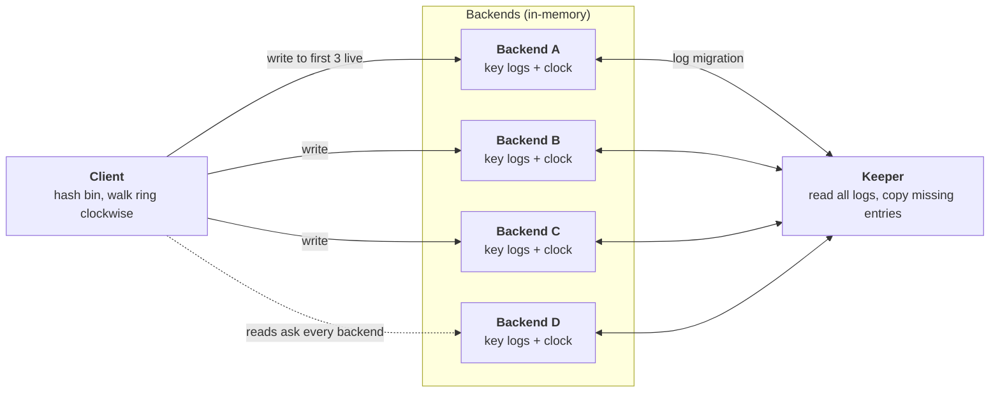

# Ringstore

A small fault-tolerant key-value store in Rust. Data is split across backends with a consistent-hash ring, every write is copied to three backends, and a keeper service copies missing log entries to restore three copies after a backend crashes.

Each key is stored as a log of operations, not as a single value. That one choice makes the rest simple: a read replays the log, and recovery is just "find the entries a backend is missing and copy them over."

## Architecture at a glance



- **Client:** finds where a key lives by itself. It never talks to the keeper.
- **Backend:** stores logs in memory. A crash loses everything on that backend.
- **Keeper:** runs log migration in the background. It saves no state of its own, so any keeper can take over from a dead one.

All processes read the same config file ([config.example.json](config.example.json)) listing the backend and keeper addresses.

## How it works

### 1. Placement: which backends own a key

Keys are grouped into **bins**, and placement is decided per bin.

1. Hash each backend's `host:port` to a position on a ring.
2. Hash the bin name onto the same ring.
3. Starting at the bin's position, walk clockwise. The first **3 live** backends you reach own the bin.

Every client and keeper does this math locally with the same config, so they all agree. There is no lookup service. If a backend dies, the walk simply skips it and the next backend on the ring becomes an owner.

### 2. The log and replay

Every key is a list of operations. Each operation has a random **ID** and a **clock** value:

```text
{id: 7f3a, clock: 12, Append("paid")}
{id: 91c0, clock: 17, Append("shipped")}
{id: b2e4, clock: 20, Remove([7f3a])}
```

To get the current value, sort by `(clock, id)` and replay from the top:

- `Append` adds an item; `Remove` deletes the exact append IDs it lists. Result above: `["shipped"]`.
- For a single value, `Set` overwrites; the last `Set` wins. Deleting is a `Set` with an empty value, kept in the log as a delete marker so an old copy cannot bring the value back.

Two backends holding the same set of operations always replay to the same answer, no matter what order the entries arrived in. Each ID counts once, so receiving the same operation twice does no harm. Two real `append("paid")` calls get two different IDs and both count.

A read asks **every** backend for the key's log, merges the logs by ID, and replays the result. This way a read still finds data that has not been copied to the current owners yet.

### 3. Write path

1. Get a clock value (see [Logical clock](#5-logical-clock)) and create the operation with a new random ID.
2. Walk the ring clockwise from the bin's position.
3. At each live backend, append the operation if that backend does not already have its ID. Skip backends that do not answer.
4. Stop after 3 backends. With fewer than 3 live backends, the write goes to all that are alive.

If a backend dies after the write, the other two copies are still there, and the keeper restores the third (next section).

### 4. Log migration (the keeper)

About once per second, each keeper runs one repair pass:

1. **Pick one keeper.** Ping every keeper with a lower index. If any answers, skip this round and let it do the work.
2. **Find live backends.** Ask every backend in the config whether it is up.
3. **Read everything.** Read every key's log from every live backend.
4. **Merge.** For each key, combine the logs from all backends into one set, removing duplicates by ID.
5. **Find the owners.** Walk the ring to find the 3 live backends that should own the key now.
6. **Copy the diff.** For each owner, read what it already has, compute `merged log - owner's log`, and append only the missing entries.

The keeper saves no progress. If it crashes halfway, the next keeper starts again at step 1. Entries that were already copied are not in the diff, so only the missing ones move. Two keepers running at the same time is also safe; they just copy the same entries and the backend keeps each ID once.

### Example: a backend crashes and restarts empty

Ring order for bin `orders` is A → B → C → D. Key `events` holds `{a, b, c}` on A, B, and C.

1. B crashes. Reads still work: they ask every backend and find `{a, b, c}` on A and C.
2. The next keeper pass sees owners are now A, C, D. D has nothing, so the keeper copies `{a, b, c}` to D.
3. B restarts at the same address with empty memory. Owners go back to A, B, C.
4. The next pass sees B is missing `{a, b, c}` and copies them to B. D still holds its copy; reads merge it, so it does no harm.

If the keeper dies after copying only `a` to B, the backup keeper reads B, sees `{a}`, and copies just `{b, c}`.

### 5. Logical clock

The clock decides the order of operations in the log. There is no wall-clock time.

- Each backend has a counter. To keep two backends from ever handing out the same number, backend `i` of `N` hands out only values `counter * N + i`. With 4 backends, backend 0 gives `0, 4, 8, ...` and backend 1 gives `1, 5, 9, ...`.
- Before asking for a value, the client reads the highest clock value seen across live backends and asks for something larger. After getting it, the client tells every backend the new highest value.
- The keeper also pushes the highest clock value it sees to all backends during each pass. A backend that restarts with an empty counter therefore still hands out larger numbers than before.

Result: a write that starts after another write finishes always gets a larger clock value, so it replays later.

## Try a real failure

You need stable Rust and, for the demo, Python 3.9+. Cargo supplies the protobuf compiler; no external `protoc` installation is required.

```sh
cargo build --locked --bin ringstore
python3 scripts/demo.py
```

The demo starts four backends and two keepers on free localhost ports, then kills a backend and the primary keeper, restarts the backend with empty memory, and checks that the backup keeper restores it. It only cleans up its own child processes.

```text
1. Four backends and two keepers are running.
2. Two identical appends remain two logical occurrences.
3. Killed a replica and the primary keeper; reads still succeed.
4. Backup keeper restored the empty replacement backend.
5. Removal hides old append IDs; a new equal append survives.
PASS: process crash, keeper takeover, repair, and list semantics.
```

## Run manually

In separate terminals, start the four backends and at least one keeper:

```sh
cargo run --locked -- backend --index 0
cargo run --locked -- backend --index 1
cargo run --locked -- backend --index 2
cargo run --locked -- backend --index 3
cargo run --locked -- keeper --index 0
```

Then use the client. `--config` defaults to `config.example.json` and `--bin` defaults to `demo`:

```sh
cargo run --locked -- --bin orders set status ready
cargo run --locked -- --bin orders get status
cargo run --locked -- --bin orders append events paid
cargo run --locked -- --bin orders list events
cargo run --locked -- --bin orders placement
cargo run --locked -- --bin orders copies events --lists
```

`placement` shows the clockwise walk and the current owners. `copies` shows which entries each backend holds. Setting an empty value deletes a key. [examples/basic.rs](examples/basic.rs) shows library use, and `RUST_LOG=debug` prints repair logs.

## Where to look in the code

| Idea | File |
| --- | --- |
| Hash ring and clockwise walk | [ring.rs](src/ring.rs) |
| Write path, reading all backends, clock | [replication.rs](src/replication.rs) |
| Log migration | [keeper.rs](src/keeper.rs) |
| Operation log, merge, and replay | [operation.rs](src/operation.rs) |
| Get / set / append / remove | [bin.rs](src/bin.rs) |

## Tests

```sh
cargo fmt --all -- --check
cargo clippy --locked --all-targets -- -D warnings
cargo test --locked --all-targets
cargo test --locked --doc
```

[Fault tests](tests/faults.rs) start real backend and keeper processes and kill them, so a crash really loses memory and connections. They cover a keeper dying in the middle of a copy, backup keeper takeover, refilling an empty restarted backend, duplicate delivery, concurrent appends, deletion, and clock restarts. [Testing notes](docs/testing.md) map each test to what it checks.

## Limits

- **Failure model:** processes crash and restart; the network is reliable; the backend list is fixed. Network partitions and changing membership are not handled.
- **One failure at a time:** the keeper needs time to restore three copies before the next backend fails.
- **In memory only:** no disk persistence. If every backend holding a key dies, that key is lost.
- **Logs only grow:** old entries, delete markers, and extra copies are never cleaned up, and reads ask every backend. Simple to reason about, but it costs memory and read traffic.

More detail is in [the architecture doc](docs/architecture.md) and [design decisions](docs/decisions.md).

## Background

Extracted from a UCSD CSE 223B group lab, keeping only the storage and repair core. [Acknowledgements](ACKNOWLEDGEMENTS.md) lists the original contributors.

Related ideas: [consistent hashing (Karger et al.)](https://people.csail.mit.edu/karger/Papers/web.pdf), [Dynamo (DeCandia et al.)](https://www.amazon.science/publications/dynamo-amazons-highly-available-key-value-store), and [logical clocks (Lamport)](https://www.microsoft.com/en-us/research/publication/time-clocks-ordering-events-distributed-system/).
