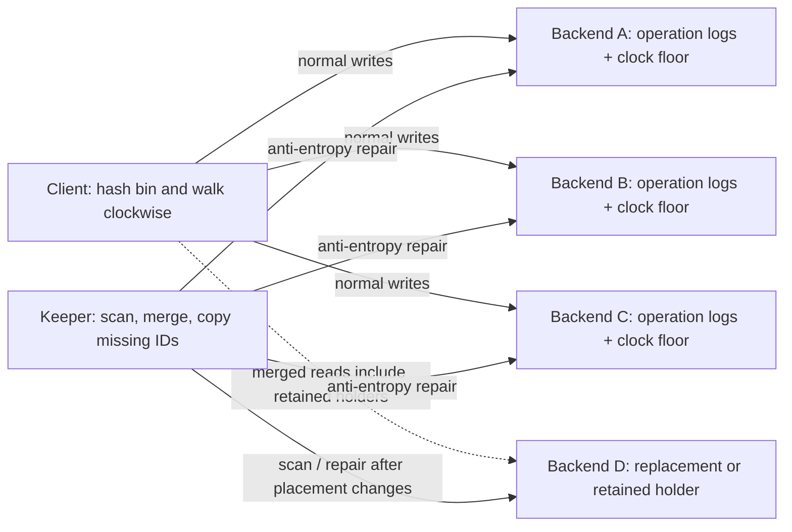

# Ringstore

A small distributed storage system in Rust: bins map directly onto a consistent-hash ring, writes reach three live backends, and disposable keepers repair missing operations after process failures.

The interesting part is the handoff. A replacement backend starts with empty memory, and a replacement keeper has no migration cursor. Ringstore recovers from surviving operation logs. Clients compute placement themselves and never contact a keeper.

## Architecture at a glance



Every client and keeper receives the same configured backend addresses. Each independently hashes normalized `host:port`, hashes the bin name, finds its successor, and walks clockwise until three distinct reachable backends accept the write. Fewer live backends means fewer copies. There is one ring position per configured endpoint and no routing-table service.

See [the architecture document](docs/architecture.md) for the protocols, invariants, and failure walkthrough; see [design decisions](docs/decisions.md) for the tradeoffs.

## Try a real failure

You need stable Rust and, for the demo, Python 3.9+. Cargo supplies the protobuf compiler; no external `protoc` installation is required.

```sh
cargo build --locked --bin ringstore
python3 scripts/demo.py
```

The demo reserves isolated localhost ports, starts four backends and two keepers, writes duplicate list values, kills a replica and the primary keeper, and restarts the replica with empty memory. It checks that the backup keeper restores all current list replicas and that removal preserves later appends. It cleans up only its own child processes.

```text
1. Four backends and two keepers are running.
2. Two identical appends remain two logical occurrences.
3. Killed a replica and the primary keeper; reads still succeed.
4. Backup keeper restored the empty replacement backend.
5. Removal hides old append IDs; a new equal append survives.
PASS: process crash, keeper takeover, repair, and list semantics.
```

## Run manually

In separate terminals, start the four configured backends and at least one keeper:

```sh
cargo run --locked -- backend --index 0
cargo run --locked -- backend --index 1
cargo run --locked -- backend --index 2
cargo run --locked -- backend --index 3
cargo run --locked -- keeper --index 0
```

Then use the client; `--config` defaults to `config.example.json`, and `--bin` defaults to `demo`:

```sh
cargo run --locked -- --bin orders set status ready
cargo run --locked -- --bin orders get status
cargo run --locked -- --bin orders append events paid
cargo run --locked -- --bin orders list events
cargo run --locked -- --bin orders placement
cargo run --locked -- --bin orders copies events --lists
```

`placement` reports the clockwise walk and current targets; `copies` reports physical entries and distinct operation IDs at each backend. Scalar deletion uses an empty value. Scalar and list keys occupy separate namespaces, even when their logical names match. [examples/basic.rs](examples/basic.rs) shows library use. `RUST_LOG=debug` enables repair diagnostics.

## Distributed systems concepts in the implementation

| Concept | Why it matters here | Implementation |
| --- | --- | --- |
| Consistent hashing | Clients derive the same successor without consulting a keeper. Port numbers distinguish local processes. | [ring.rs](src/ring.rs) |
| Replication and incarnation checks | A write targets up to three live processes and rechecks placement and process identity before returning. | [replication.rs](src/replication.rs) |
| Anti-entropy | Repair merges surviving logs and copies missing IDs; the next pass reconstructs interrupted work. | [keeper.rs](src/keeper.rs) |
| Idempotent application | Retrying one operation keeps one logical occurrence, while two intentional equal appends keep two. | [operation.rs](src/operation.rs) |
| Deterministic convergence | Replicas with the same operation set project the same result, ordered by `(logical timestamp, operation ID)`. | [operation.rs](src/operation.rs) |
| Observed removal and tombstones | Removes refer to append IDs; late delivery cannot resurrect a removed occurrence. Empty scalar sets remain deletion records. | [bin.rs](src/bin.rs) |
| Logical clocks | Atomic backend counters use disjoint numeric slots; replicated floors and incarnation checks support allocator restart. | [replication.rs](src/replication.rs) |
| Failure detection without consensus | The lowest reachable keeper index normally repairs. Overlapping workers are safe because repair is repeatable. | [keeper.rs](src/keeper.rs) |

Operation IDs are random 128-bit identities, not content hashes. Hashing the value would incorrectly collapse two intentional `append("same")` calls. Logical timestamps provide order; IDs resolve ties and identify repeated delivery. A total order alone does not guarantee convergence: surviving operations must also reach the replicas.

## Evidence

```sh
cargo fmt --all -- --check
cargo clippy --locked --all-targets -- -D warnings
cargo test --locked --all-targets
cargo test --locked --doc
```

[Fault tests](tests/faults.rs) launch real backend and keeper child processes. Killing a process loses its connections and all memory. Tests cover interrupted copy, keeper takeover, fresh backend repair, merged histories, concurrent append ordering, duplicate delivery, deletion, allocator restart, calls in flight during a crash, clock saturation, namespace isolation, and three live endpoints in a 300-address configuration. [Testing notes](docs/testing.md) map the assertions to the claims, and [recorded local validation](docs/validation.md) documents the verified results. GitHub Actions runs formatting, Clippy, tests, and the crash demo on pushes and pull requests.

## Scope and limits

This is an educational implementation for crash-stop/restart failures on a reliable network with a fixed configured membership. Backends are in-memory. Sequential backend events must leave time for repair, and at least three live backends are required for the intended replication safety envelope. One or two live backends remain usable with reduced redundancy. There is no claim of partition tolerance, consensus, transaction isolation, disk durability, or production readiness.

Reads query all configured endpoints and merge reachable retained histories; old copies and tombstones are never compacted. This keeps handoff understandable but increases read traffic and memory use. The 300-address test checks functionality with three live processes, not a 300-process performance benchmark or a universal repair-time bound. See [limits and future work](docs/architecture.md#limits-and-future-work).

## Background

The project is extracted from a UCSD CSE 223B group lab and keeps the storage/repair core, without the course frontend, grader, or assignment history. [Acknowledgements](ACKNOWLEDGEMENTS.md) records its provenance and original contributors.

Related foundations: [Karger et al., consistent hashing](https://people.csail.mit.edu/karger/Papers/web.pdf), [DeCandia et al., Dynamo](https://www.amazon.science/publications/dynamo-amazons-highly-available-key-value-store), and [Lamport, logical clocks and event ordering](https://www.microsoft.com/en-us/research/publication/time-clocks-ordering-events-distributed-system/). Ringstore uses a small subset of these ideas; it does not implement Dynamo's full protocol.
