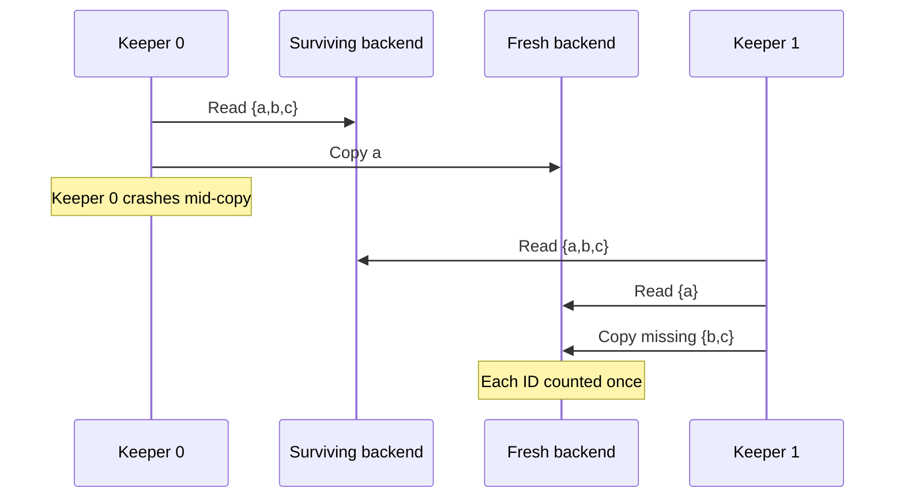

# Architecture

This document goes one level deeper than the [README](../README.md). It follows the same order: placement, the log, writes, reads, log migration, and the logical clock.

## Goal and failure model

Ringstore stores named **bins**. Each bin holds two kinds of keys: single values (`set` / `get`) and lists (`append` / `list` / `remove`). The goal is to keep data available when a backend crashes and loses all its memory, or when a keeper dies in the middle of copying data.

What the design assumes:

- **Fixed membership.** Every process reads the same list of backend and keeper addresses. Adding or removing backends at runtime is not supported.
- **Crash and restart only.** A process either works correctly or is dead. A restarted backend comes back at the same address with empty memory.
- **Reliable network.** A failed connection means the process is dead, not that the network is split.
- **One failure at a time.** After a backend fails, the keeper has time to restore three copies before the next failure. The original lab assumed at least 30 seconds between backend events and under 20 seconds to copy a backend's data. Those numbers come from the lab, not from measurements of this repository.

Not handled: network partitions, losing every holder of a key at once, malicious processes, disk persistence, and transactions.

## Components

| Component | Keeps | Does not need |
| --- | --- | --- |
| Client | The ring, cached gRPC connections | The keeper |
| Backend | Key logs in memory, a clock counter, a restart ID, the highest clock value seen | Other backends' addresses |
| Keeper | The ring, the keeper list and its own index | Any saved progress |

- [storage.proto](../proto/storage.proto) defines the raw storage and clock calls a backend serves.
- [control.proto](../proto/control.proto) defines backend status (restart ID, highest clock value), pushing the highest clock value, and keeper heartbeats.

Clients talk only to backends. Only keepers ping other keepers.

The **restart ID** is a random value a backend picks when it starts. A backend that crashed and came back at the same address has a new restart ID, so other processes can tell it is a fresh, empty process.

## Placement

1. **Normalize addresses.** Each configured backend becomes `http://host:port` in lowercase. Duplicates are removed.
2. **Hash backends.** Hash each `host:port` to a 64-bit position on the ring (FNV-1a plus a fixed mixing step, in [ring.rs](../src/ring.rs)). Every process uses the same function, so every process builds the same ring. If two hashes collide, the address breaks the tie.
3. **Hash the bin.** Hash the bin name onto the same ring.
4. **Walk clockwise.** Start at the first backend at or after the bin's position, wrapping around the end of the ring. Visit each backend once. The first 3 live backends are the bin's **owners**.

Each backend has exactly one ring position; there are no virtual nodes. DNS aliases are not resolved, so do not list the same backend under two names.

Because the clockwise walk is computed locally, there is no routing table to store or keep in sync. Changing the config changes the ring (and the clock slots below), so it is not a supported runtime operation.

### Key names on a backend

Backends store raw keys of the form:

```text
ringstore::v1::{bin}::{scalar|list}::{key}
```

Bin and key names are escaped, so a `::` inside a name cannot be confused with the separator. Single-value keys and list keys live in separate namespaces even when they have the same name.

## The log and replay

Every key is a log of operations, stored as JSON entries:

```text
Operation {
    id:        random 128-bit value, as hex
    timestamp: logical clock value
    action:    Set(value) | Append(value) | Remove([append ids])
}
```

**Merging.** To combine copies of a log from several backends, take the union of their entries by ID, then sort by `(timestamp, id)`. Two entries with the same ID but different contents is an error. The order in which logs are merged does not matter, and merging the same log twice changes nothing. So any backends holding the same set of IDs end up with the same sorted log.

**Replay.**

- **Single value:** the last entry wins. If it is `Set("")`, the key is deleted. This delete marker stays in the log, so an old copy of an earlier `Set` cannot bring the value back.
- **List:** start with every `Append`, then hide every append ID named by any `Remove`. Remaining items appear in log order.

**Why removes name IDs.** A `remove(key, "paid")` call first reads the list, collects the IDs of the `"paid"` appends it can see, and writes `Remove([those IDs])`. As a result:

- If one of those appends reaches a backend late, after the remove, it is still hidden, because its ID is in the remove.
- An `append("paid")` that the remove did not see has a new ID, so it survives.
- Two concurrent removes may each report the same item as removed.

**Why IDs are random, not a hash of the value.** Two real `append("paid")` calls are two different operations and both must count. Delivering one operation twice must count once. A random ID created per call gives exactly that. Hashing the value would merge the two real appends into one.

## Write path

1. Ask for a clock value (see [Logical clock](#logical-clock)) and create one operation with a new random ID.
2. Walk the ring clockwise from the bin's position.
3. At each backend: read its current log for the key and append the operation if its ID is missing. If the backend does not answer, skip it.
4. Stop after 3 successful backends, or after visiting every backend if fewer than 3 are alive.

If the reply to an append is lost, the same operation can be stored twice on a backend. That is harmless, because merge keeps one entry per ID.

This protects retries *inside* one call. If the caller itself crashes and calls `append` again, that second call gets a new ID and appends again. There is no caller-supplied idempotency key.

## Read path

1. Ask **every** configured backend for the key's log at the same time.
2. Merge the logs that come back and replay.

Reading every backend, not just the current owners, matters during recovery. A backend that just restarted is an owner but is still empty. If reads trusted only the owners, data would look missing until the keeper copied it over.

- **Single-value reads** also copy the newest entry (including a delete marker) to the current owners before returning, so the value you just read does not depend on one surviving copy.
- **List reads** do not write back; the keeper fills in missing entries.
- **Listing keys** collects raw key names from all backends, keeps the ones for this bin and kind, matches the prefix or suffix, and drops keys whose replayed value is empty. The result is not a consistent snapshot across keys.

**Timeouts.** Connecting to a backend times out after 300 ms; a backend call times out after 25 seconds. If no backend answers, the client waits 25 ms and tries again, forever. Wrap calls in your own timeout if you need one. Since reads ask every backend, a slow backend slows down every read.

## Log migration

Log migration is how the keeper restores three copies after a failure. It is in `reconcile` in [keeper.rs](../src/keeper.rs).

**When it runs.** Each keeper runs one pass at startup. After that, about once per second, it pings every keeper with a lower index. If one answers, it skips the round; otherwise it runs a pass. This keeps normally one keeper busy, but it is not a strict leader election. Two keepers running at once is safe, as explained below.

**One pass:**

1. **Find live backends** and their highest clock values.
2. **Read every log.** For each live backend, at the same time, list all its keys and read each key's log. If a backend dies during this step, skip it; the other copies cover it, and the next pass catches anything new.
3. **Sync the clock.** Take the highest clock value seen across backends and entries, and push it to every backend.
4. **Merge** the copies of each key's log by ID.
5. **Find owners.** For each key, walk the ring and take the first 3 live backends.
6. **Copy the diff.** For each owner, read what it already has, compute `merged log - owner's log` by ID, and append only the missing entries. Different backends are filled in parallel. If a copy fails, log it and let the next pass retry.

**Why no saved progress is needed.** Everything the keeper needs is in the backends' logs. Each pass recomputes the work from scratch, and copying is "add missing IDs only," so redoing it is harmless.

Example: a surviving backend has `{a, b, c}`, a fresh backend has received only `{a}`, and the keeper crashes. The backup keeper reads both, computes `{a, b, c} - {a} = {b, c}`, and copies just those. If `a` had actually been appended twice because a reply was lost, merge still counts it once.



**Extra copies.** After the owners change, the keeper does not delete the old copies. Reads still see them and they do no harm, but a key can end up on more than three backends.

## Logical clock

The clock orders operations in the log. It is a counter, not wall-clock time.

**Avoiding duplicate values.** With `N` configured backends, backend number `i` (its slot) only hands out values `counter * N + i`. With 4 backends:

| Backend | Values |
| --- | --- |
| 0 | 0, 4, 8, 12, ... |
| 1 | 1, 5, 9, 13, ... |
| 2 | 2, 6, 10, 14, ... |

Each backend's counter is atomic, so one backend never repeats a value, and different backends never overlap.

**Getting a clock value** (`clock` in [replication.rs](../src/replication.rs)):

1. Ask live backends for their highest clock value seen, and take the maximum.
2. Pick the first live backend on the ring and ask it for a value above that maximum.
3. Push the new value to every backend as the highest value seen.
4. Check that the backend that handed out the value still has the same restart ID. If it restarted, start over.

**Surviving restarts.** The highest-value-seen is kept only in memory, but it is copied to every backend, and the keeper pushes it again each pass. A restarted backend's counter starts at zero, but clients always ask for a value above the maximum the surviving backends remember. So a write that starts after another write has finished always gets a larger value.

Concurrent calls can finish in a different order than their values. That is fine: the log only needs some fixed order, and `(timestamp, id)` provides it.

**Overflow.** Clock values stop at `u64::MAX` instead of wrapping. Log timestamps are `u128`, so after the clock hits the maximum, a write reads the key's last timestamp and uses one more. Writes to the same key keep their order.

## What the tests show

| Property | Checked by |
| --- | --- |
| Every process builds the same ring and visits each backend once. | Ring unit tests |
| Delivering the same operation twice counts once. | Merge unit tests and a duplicated-call fault test |
| Two real equal appends both count. | Fault tests and demo |
| A removed item stays removed even if its append arrives late. | Merge unit tests and a process-level remove test |
| A backup keeper finishes a copy that a crashed keeper started. | Fault test that kills the keeper at a fixed point mid-copy |
| A backend restarted at the same address is refilled. | Empty-restart and clock-restart fault tests |
| Concurrent appends from different clients end in one order. | 24 concurrent appends compared from fresh clients |

See [testing.md](testing.md) for commands and test names. These tests cover the specific failure sequences listed; they are not a proof for every possible sequence.

## Limits and future work

- **Logs and delete markers grow forever.** Nothing is compacted.
- **Work grows with data.** Reads ask every backend, listing keys replays every candidate, and each keeper pass reads full logs.
- **Message size.** gRPC's default 4 MiB message limit caps how large one key's log can be.
- **No performance numbers.** Throughput and repair time have not been measured.

Possible next steps: read and copy logs in chunks, let backends do append-if-missing themselves, safe cleanup of old copies and delete markers, benchmarks, caller-supplied idempotency keys, and runtime membership changes. Disk persistence, TLS and authentication, partition tolerance, and quorum or consensus would each need new protocols and tests. Backend traffic is plaintext and meant for local use.
