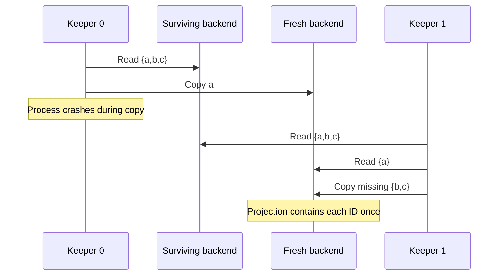

# Architecture

## Goal and failure model

Ringstore provides named bins of scalar and list keys. Its focus is recovering replicated state when a backend loses all memory or a keeper dies during migration.

The supported model has a fixed list of configured endpoints, a reliable network, and crash-stop/restart process failures. A failed connection is treated as a crashed process, rather than a partition. Restarts use the same address with fresh memory and a new incarnation ID. At least one backend is available; replication safety depends on maintaining at least three and allowing repair between successive backend failures. The source lab assumed backend events at least 30 seconds apart and whole-backend copying under 20 seconds. Those are model assumptions, not measured throughput guarantees of this repository.

Membership reconfiguration, partitions, simultaneous loss of all holders, Byzantine processes, disk persistence, and transactions are outside this model.

## Components and boundaries

| Component | Owns | Does not need |
| --- | --- | --- |
| Client | Ring, cached RPC channels, current call's operation identity | Keeper address or routing information |
| Backend | In-memory raw storage, atomic counter, incarnation, monotone clock floor | Other backend addresses |
| Keeper | Ring, keeper addresses/index, one reconciliation pass | A durable migration cursor or frontend connection |

[storage.proto](../proto/storage.proto) defines raw scalar/list/clock RPCs. [control.proto](../proto/control.proto) defines backend inspection, clock-floor advancement, and keeper heartbeats. Backend metadata lives outside user key spaces. Frontends contact backends directly; only keepers probe keeper heartbeats.

Readiness follows a successful bind. A keeper also completes its initial reconciliation before signalling readiness. Its server and worker futures share a lifetime; owned `JoinSet`s abort their work when dropped.

## Placement

Normalize each configured endpoint as `http://host:port`, lowercase its authority, and deduplicate matching normalized strings. The hash input for a node is its `host:port`; the hash input for a bin is its unencoded name. A specified FNV-1a hash followed by a fixed avalanche step ensures all processes use the same mapping. Hash collisions have an address tie-breaker.

The bin's successor is the first node at or after its hash, wrapping around if necessary. Walk clockwise once, skipping unsuccessful backend RPCs, until three distinct endpoints accept the operation. This iterator is computed locally; no persisted preference list is needed. One endpoint has one ring position. DNS aliases are not resolved into a shared physical-node identity, so configurations must not list aliases for the same backend process.

The configured membership is identical everywhere. Changing the configuration can change clock slots as well as ownership and is not a supported rolling-reconfiguration protocol.

## Operation model

Each JSON entry contains:

```text
Operation {
    id: random 128-bit identity, encoded as hex,
    timestamp: u128 logical timestamp,
    action: Set(value) | Append(value) | Remove(observed_append_ids)
}
```

An encoded key has the shape `ringstore::v1::{escaped bin}::{scalar|list}::{escaped key}`. Escaping makes delimiters unambiguous, and scalar and list namespaces remain separate.

Merge unions operations by ID, rejects conflicting contents for an ID, and sorts by `(timestamp, id)`. Union is associative, commutative, and idempotent for valid histories. Sorting gives one deterministic projection once replicas hold the same operation set. Equal contents have different identities when they are distinct calls; duplicate network delivery reuses the original identity.

Scalars project the newest set. An empty set is a deletion tombstone, retained in the log. Lists project surviving append IDs in sorted order. A remove contains the matching append IDs observed by its read; all those IDs are hidden even if their append entries arrive later. A concurrent append not observed by the remove survives. Concurrent removes may each count the same observed occurrence.

This is an observed-removal design inspired by convergent data types. The repository checks merge laws and representative schedules; it is not a formal verification of a general-purpose CRDT framework.

## Write protocol

1. Allocate a logical timestamp and create one operation ID.
2. Walk clockwise. Inspect the candidate incarnation, read its existing log, and append the missing operation.
3. Record the address and incarnation of each successful destination; stop after three, or finish the ring when fewer exist.
4. Inspect reachable nodes again and compute the current first three targets.
5. Return only when those targets match the successfully copied incarnations. Otherwise retry the same operation identity.

An acknowledgement lost after an append can lead to repeated physical entries. Merge still applies the operation once. This provides idempotent delivery within an ongoing call and repair; a caller retrying an entire API call after its own crash creates a new ID and can append again. There is no durable caller-supplied idempotency token.

Incarnation rechecks prevent address reuse alone from being mistaken for successful delivery to the replacement process. They are sampled observations under the supported failure model, not consensus or an atomic membership snapshot.

## Reads and enumeration

Read all configured endpoints concurrently, retain successful log responses, merge by ID, and project. This includes old holders after placement changes. A fresh target can be reachable but empty; trusting only that target would lose sight of the retained history before repair finishes.

Scalar reads copy the newest set, including deletion tombstones, to current targets before returning. List reads merge without a writeback; periodic keeper repair fills missing histories. Key enumeration unions encoded candidate keys, decodes logical names, applies prefix/suffix matching, and excludes empty projected state. Enumeration across multiple keys is not a transactional snapshot.

Connection attempts have a 300 ms deadline; backend RPCs have a 25 second deadline. Unsuccessful availability sweeps back off 25 ms and retry. If no backend ever becomes available, storage calls keep waiting; callers may wrap calls in a timeout. Owned tasks are cancelled when the enclosing request future is dropped. Broad reads make latency sensitive to the slowest endpoint deadline.

## Restartable anti-entropy

Each keeper's initial pass runs unconditionally. Later passes run once per second when no lower-index keeper answers a heartbeat. This limits duplicate scans. It does not establish an exclusive leader: multiple keepers can repair concurrently without changing logical results.

A pass discovers reachable backends, scans their retained logs, merges the histories for each key, computes the current targets, and copies missing IDs. Destination copies run across backends concurrently. Partial backend scans or destination failures are retried on later passes. Backend clock floors are also synchronized.

Example: source contains `{a,b,c}`, destination accepts `{a}`, and the keeper crashes. The replacement keeper rescans both histories and computes `{a,b,c} - {a} = {b,c}`. It needs no cursor. If `a` was appended but the response was lost, a repeat still produces one logical occurrence.



Retained copies are not removed after handoff. This lets a new keeper rediscover work from backend state, but the eventual physical replica count can exceed three.

## Logical clock and restart

For `N` configured endpoints, a backend in deterministic slot `i` allocates values of the form `counter * N + i`. Atomic raw backend clocks prevent collision within a process; slots separate concurrent allocators. A client observes the maximum reachable floor, chooses a counter that respects that floor and the requested lower bound, publishes the resulting floor to reachable backends, and rechecks its allocator's incarnation before returning. A changed incarnation causes retry.

Floors are ephemeral but replicated. Recovery relies on surviving processes, just as operation recovery does. This is a logical allocation protocol, not wall-clock synchronization, a vector clock, or a partition-safe sequencer. Concurrent replies can arrive out of numeric order. Sequential calls observe completed floors and advance.

Arithmetic widens before multiplying and saturates at `u64::MAX`, where public-clock repetition is allowed. Operation timestamps are `u128`; after public saturation, a mutation reads the merged per-key timestamp and advances it, preserving sequential scalar/list mutation order.

## Invariants and evidence

| Invariant | Evidence |
| --- | --- |
| Identical membership gives identical ring order; endpoints are visited once. | Ring normalization/order tests |
| Repeated delivery of one ID cannot create a second logical append. | Operation merge tests and injected duplicate RPC delivery |
| Two intentional equal appends remain distinct. | Process fault tests and demo |
| A removed observed ID stays removed after late delivery. | Operation tests and process-level list removal |
| Replacement keeper can reconstruct partial-copy work. | Child-process kill at a deterministic migration barrier |
| Backend restart is detected despite address reuse. | Empty replacement repair and allocator restart tests |
| Concurrent completed appends have one final order across clients. | 24 concurrent appends and fresh-client comparisons |

See [testing.md](testing.md) for commands and test names. Tests establish the exercised schedules; they do not constitute a proof over arbitrary executions.

## Limits and future work

All histories and tombstones grow without bound. Reads scan every configured endpoint, key enumeration projects each candidate, and repair reads full logs before computing differences. The default gRPC decoding limit is 4 MiB per message; large histories need chunked retrieval/copy or explicit bounds. No large-volume throughput or repair-time guarantee has been measured.

Useful next steps are bounded/chunked log RPCs, backend-side atomic append-if-absent, safe compaction with a handoff protocol, controlled benchmarks, durable caller idempotency tokens, and an explicit membership reconfiguration design. Disk persistence, TLS/authentication, partition tolerance, and quorum/consensus semantics would require additional protocols and tests. The current backend transport is plaintext and intended for local experiments.
